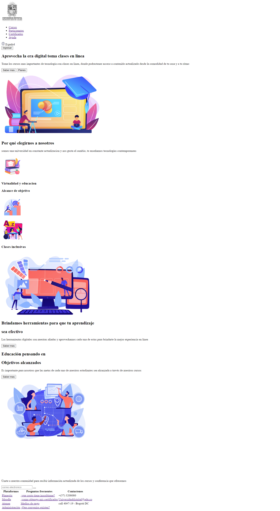
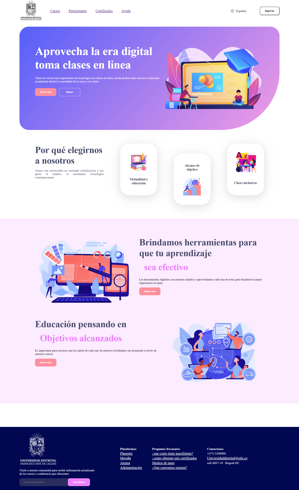
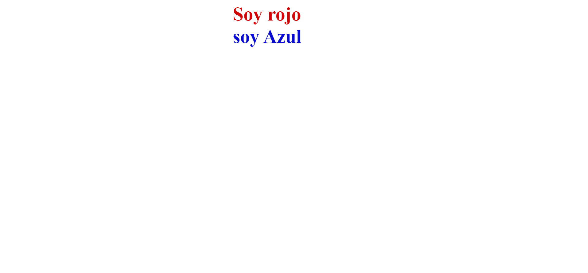
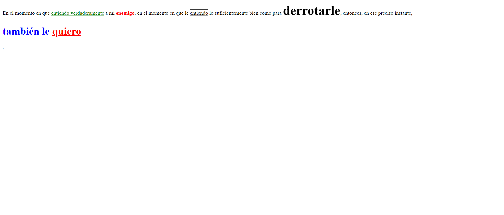
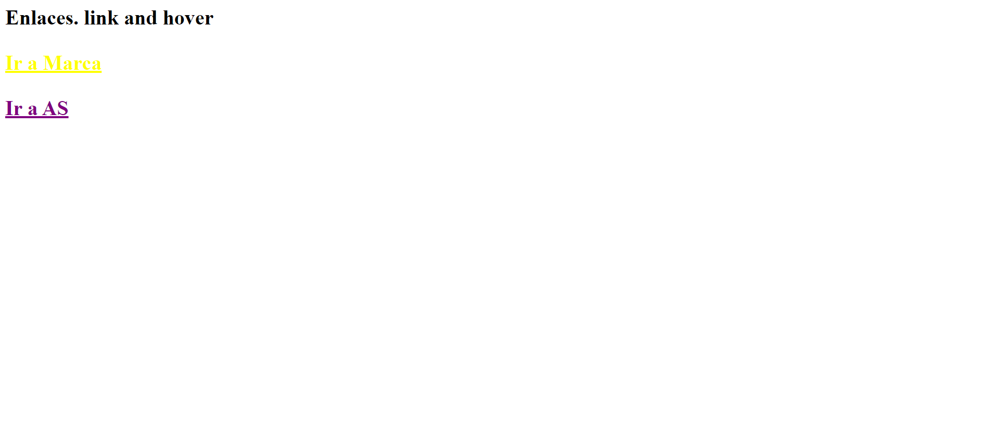
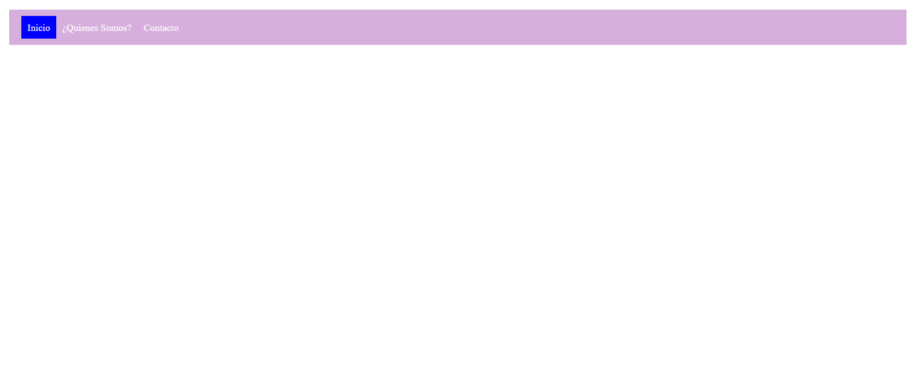
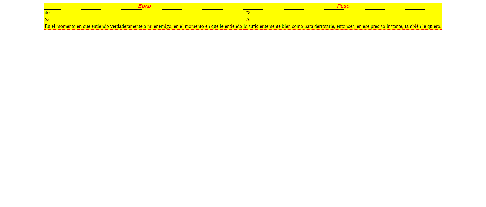

<h1>Taller 9 Dayana Caterine Narvaez Gomez</h1>

<h2> Información</h2>

Curso: full Stack Basico - Grupo 1

Profesor: Cristian Patiño

<h3>Link Pagina Web</h3>
<a href="https://dayananarvaez.github.io/taller-9-full-stack/" target="_blank">Link Pagina web</a>

<h2> Punto 1: Link figma</h2>

<a href="https://www.figma.com/file/4cFpvNwtI8wvfKmarZy8Us/Taller-No.9---Dayana-C.-Narvaez-G.?type=design&node-id=0%3A1&mode=design&t=uU7k4ySaDCNrlkaZ-1" target="_blank">Link de Figma</a>

<h2> Punto 2: Html</h2>

<h2> Punto 3: CSS</h2>

<h2> Punto 4: titulos</h2>

<h2> Punto 5: texto</h2>

<h2> Punto 6: letras</h2>

<h2> Punto 7-8: menu</h2>

<h2> Punto 9: tabla</h2>

